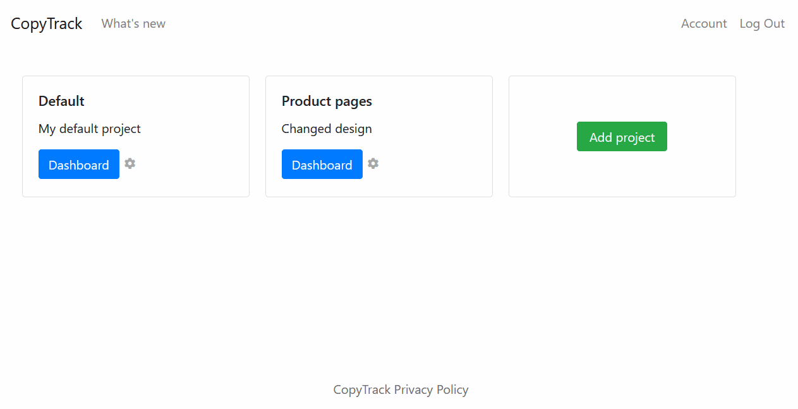
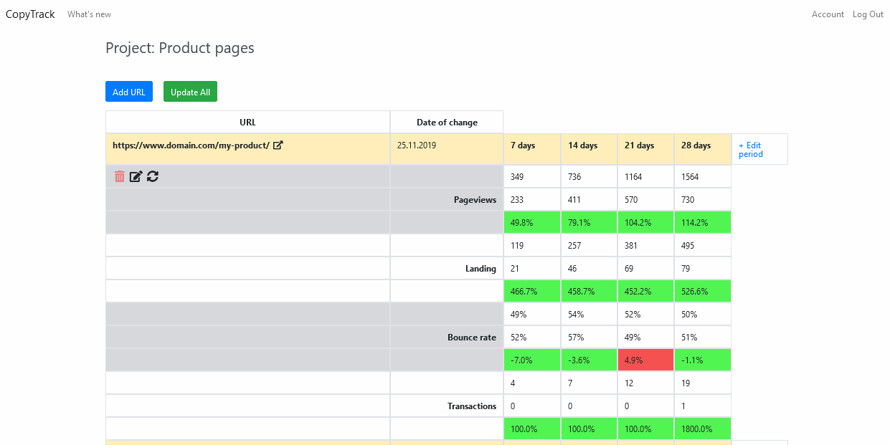
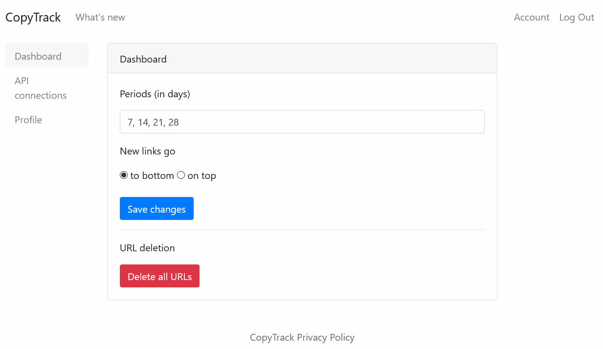
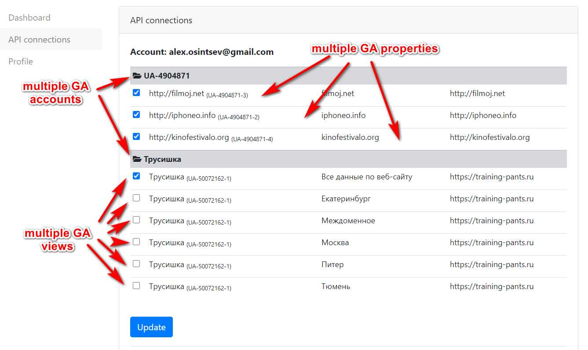
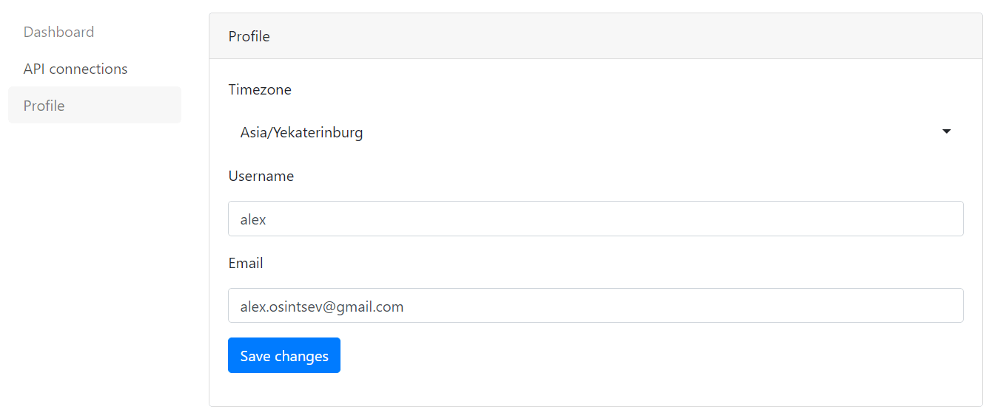

# CopyTrack

> Tracking performance for changed website pages based on Google Analytics metrics 

- It's an early MVP
- It has hardcoded metrics for now (pageviews total sessions, 
landing total sessions, bounce rate and transactions)
- The app uses Google Analytics Management API to retrieve info 
about Google Analytics account (Account ID, Property ID, Profile ID)
- The app uses Google Analytics Reporting API to get data for selected profile
- Calculates metrics only when Google Analytics days is over
- Sign in with email, Google Oauth

---

**Screenshots**

***Projects view***



***Link stats view***



***Settings for dashboard***



***Settings for API connections***



***Profile settings***



---

## Table of Contents

- [Clone](#clone)
- [Installation](#installation)
- [Setup](#setup)
- [License](#license)

---

## Clone

- Clone this repo to your server using `https://github.com/kienli/copytrack.git`

## Installation

- Create Python virtual environment on the server

On macOS and Linux:
```shell
$ python3 -m venv env
```

On Windows:
```shell
$ python -m venv env
```
- Activate virtual environment

On macOS and Linux:
```shell
$ source env/bin/activate
```

On Windows:
```shell
$ .\env\Scripts\activate
```
- Install dependencies
```shell
$ pip install -r requirements.txt
```
- Install additional packages to Linux system

```shell
$ sudo apt install nginx
$ sudo ufw allow 'Nginx Full'
$ sudo apt install postgresql postgresql-contrib redis-server supervisor
```
Template of Nginx config file is placed in the deploy folder
 
- Created database user
```shell
$ sudo -u postgres createuser --interactive
```
> Enter name of role to add: copytrack

> Shall the new role be a superuser? (y/n) y

- Add password and create database
```shell
$ sudo su - postgres
$ psql -c "alter user copytrack with password 'StrongPassword'"
$ createdb copytrack
$ psql
$ grant all privileges on database copytrack to copytrack;
```

## Setup

- Copy config files for supervisor from the deploy
 folder to /etc/supervisor/conf.d/

- Migrate database
```shell
$ FLASK_APP=app.py
$ flask db init
$ flask db migrate
$ flask upgrade
```

or restore database from a previously made database dump

Dump database:
```shell
$ pg_dump -U db_user -W -F t db_name > /path/to/your/file/dump_name.tar
```

Restore database:
```shell
$ pg_restore -d db_name /path/to/your/file/dump_name.tar -c -U db_user
 ```
---

- Create .env file

The template of .env file is placed in the deploy folder

- Start app
```shell
$ sudo supervisorctl start copytrack
 ```

Stop app
```shell
$ sudo supervisorctl stop copytrack
 ```

Restart app
```shell
$ sudo supervisorctl restart copytrack
 ```

## License

[](http://badges.mit-license.org)

- **[MIT license](http://opensource.org/licenses/mit-license.php)**
